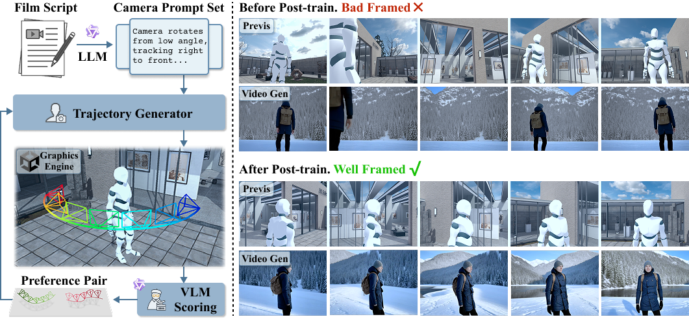

# VERTIGO: Visual Preference Optimization for Cinematic Camera Trajectory Generation

<p align="center">
  <a href="http://vertigo.magic-lab.tech/"></a>
</p>

<p align="center">
  
</p>

VERTIGO post-trains a text-conditioned 3D camera trajectory generator with visual preference signals. A pretrained trajectory generator proposes candidate camera paths, Unity renders fast previews, a cinematic VLM scores how well the rendered shots match the prompt, and DPO aligns the generator toward better framing, prompt adherence, and visual quality.

This repository currently contains trajectory-generator training, inference, and DPO post-training code. VLM scoring utilities will be released later; the DPO trainer consumes preference pairs exported by the Unity/VLM pipeline.

## Updates

- Initial cleanup for the VERTIGO open-source codebase.
- Training and inference code for the autoregressive trajectory generator is available.
- DPO post-training code is available through `train_dpo.py`.
- VLM scoring utilities are reserved for the upcoming release.

## Install

Make sure PyTorch with CUDA is installed for your machine. Training uses `flash-attn`; Ampere or newer GPUs are recommended.

```bash
git clone <VERTIGO_REPO_URL>
cd VERTIGO

conda create -n vertigo python=3.10
conda activate vertigo

pip install flash-attn --no-build-isolation
pip install -r requirements.txt
```

If you use a local Stable Diffusion text encoder, pass it with `--sd-model-path`. Otherwise the default `stabilityai/stable-diffusion-2-1-base` will be loaded from Hugging Face.

## Data Format

The current training data is a subset of the VERTIGO/LenScript trajectory data. Each sample is expected to follow the trajectory-generator format below:

```text
LenScript_subset/
+-- train/
|   +-- <scene_id>/
|       +-- <shot_id>_caption.json
|       +-- <shot_id>_transforms_cleaning.json
|       +-- <shot_id>_rgb.png              # required for RGB/RGBD modes
|       +-- <shot_id>_depth.npy            # required for RGBD mode
+-- splits/
    +-- train.txt
    +-- test.txt
```

For text-only training, each caption JSON should contain the key used by `--text-key`, typically `Movement`. For multimodal training, `Concise Interaction` is used by default.

## Train

Text-to-trajectory training:

```bash
accelerate launch --config_file acc_configs/gpu2.yaml main.py ArAE \
  --workspace workspace \
  --exp-name vertigo_text \
  --cond-mode text \
  --text-key Movement \
  --num-cond-tokens 77 \
  --path /path/to/LenScript_subset/train \
  --train-split-file /path/to/LenScript_subset/splits/train.txt \
  --test-split-file /path/to/LenScript_subset/splits/test.txt \
  --camera-norm-mode origin_global \
  --camera-translation-norm dataset_p99 \
  --batch-size 16 \
  --num-workers 8 \
  --num-epochs 128 \
  --lr 1e-5
```

A reusable launcher is provided at `scripts/train_shot_origin_global.sh`. Set `DATA_ROOT`, `SPLIT_DIR`, and optional normalization statistics before running it.

```bash
DATA_ROOT=/path/to/LenScript_subset/train \
SPLIT_DIR=/path/to/LenScript_subset/splits \
bash scripts/train_shot_origin_global.sh
```

RGBD-conditioned training is still supported by the model:

```bash
accelerate launch --config_file acc_configs/gpu2.yaml main.py ArAE \
  --workspace workspace \
  --exp-name vertigo_rgbd \
  --cond-mode depth+image+text \
  --text-key "Concise Interaction" \
  --num-cond-tokens 591 \
  --path /path/to/LenScript_subset/train
```

## Inference

Single prompt inference:

```bash
python eval.py ArAE \
  --workspace outputs \
  --name demo/push_in_medium_shot \
  --resume checkpoints/vertigo_text.safetensors \
  --cond-mode text \
  --text-key Movement \
  --text "The camera slowly pushes in while keeping the character in a medium shot at the center of the screen."
```

Batch inference from a dataset-style folder:

```bash
python infer.py ArAE \
  --workspace outputs \
  --resume checkpoints/vertigo_text.safetensors \
  --cond-mode text \
  --text-key Movement \
  --test-path /path/to/LenScript_subset/test \
  --test-repeat 1
```

Generated trajectories are saved as `*_transforms_pred.json`, with Blender-free trajectory previews saved as `*_traj.png`.

## VLM Scoring

Coming soon.

## DPO Post-Training

DPO optimizes the trajectory generator with preference pairs derived from rendered-view scoring. The policy is initialized from `--resume`; the frozen reference policy defaults to the same checkpoint unless `--dpo-reference` is provided.

Preference data is a JSONL file with one pair per line:

```json
{"prompt": "The camera slowly pushes in while keeping the character centered.", "chosen": "pairs/case_000/chosen_transforms.json", "rejected": "pairs/case_000/rejected_transforms.json", "chosen_score": 0.82, "rejected_score": 0.41}
```

`chosen` and `rejected` can be absolute paths or paths relative to `--dpo-data-root` or the JSONL file. Each trajectory file should use the same `frames[].transform_matrix` plus intrinsics format as training/inference outputs.

Minimal command:

```bash
accelerate launch --config_file acc_configs/gpu2.yaml train_dpo.py ArAE \
  --workspace workspace \
  --exp-name vertigo_dpo \
  --resume checkpoints/vertigo_text.safetensors \
  --dpo-preference-path /path/to/vertigo_preferences.jsonl \
  --dpo-data-root /path/to/preference_assets \
  --cond-mode text \
  --text-key Movement \
  --num-cond-tokens 77 \
  --camera-norm-mode origin_global \
  --camera-translation-norm dataset_p99 \
  --batch-size 4 \
  --num-workers 4 \
  --num-epochs 128 \
  --lr 1e-6 \
  --dpo-beta 0.1
```

A launcher template is provided:

```bash
PREFERENCE_PATH=/path/to/vertigo_preferences.jsonl \
DATA_ROOT=/path/to/preference_assets \
POLICY_CKPT=checkpoints/vertigo_text.safetensors \
bash scripts/train_dpo.sh
```

Useful options: `--dpo-reference` sets a separate frozen reference checkpoint, `--dpo-score-margin` filters weak pairs when scores exist, `--dpo-sft-weight` adds a small preferred-trajectory NLL regularizer, and `--dpo-logprob-reduction mean` is available for variable-length trajectory pairs.

Use the same camera normalization mode and translation statistics as the supervised checkpoint used by `--resume`; otherwise the preferred/rejected trajectories will be tokenized in a different coordinate space.

## Utilities And Related Projects

- [ShotBench](https://arxiv.org/abs/2506.21356): VERTIGO uses a ShotBench-style cinematic VLM as the starting point for visual preference scoring. Example use: render several Unity previews for the same prompt, ask the VLM to caption or judge camera movement and framing, then rank the trajectories.
- [Wan2.2](https://github.com/Wan-Video/Wan2.2) / [VACE](https://github.com/ali-vilab/VACE): VERTIGO trajectories can be used to render Unity previews and then transfer the result with VACE-style video-to-video generation. Example use: export a Unity render driven by `*_transforms_pred.json`, feed it to Wan2.2 VACE, and compare whether improved framing survives stylized video transfer.

## Acknowledgements

VERTIGO builds on the autoregressive trajectory-generation foundation introduced by [GenDoP](https://arxiv.org/abs/2504.07083). We sincerely thank the GenDoP authors for their excellent work and open-source contribution.

## Citation

If this repository helps your work, please consider citing VERTIGO. The VERTIGO BibTeX will be added with the paper release.
